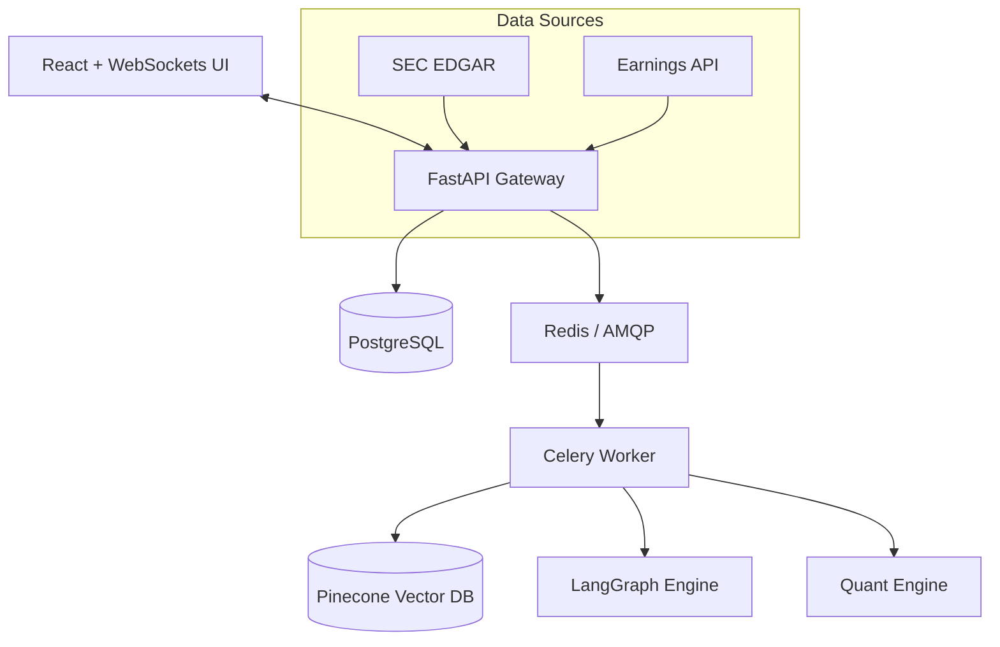
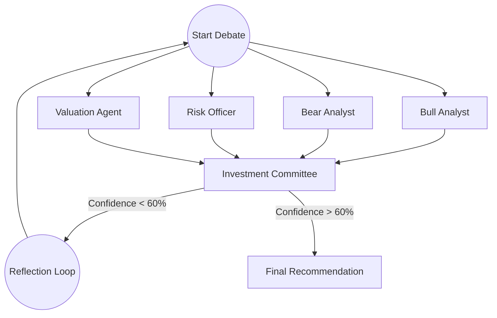

# AI Equity Research Analyst

<div align="center">
  
  
  <p><strong>Institutional-Grade AI Equity Research Platform Powered by Multi-Agent Debate & Quantitative Finance</strong></p>

  [](https://opensource.org/licenses/MIT)
  [](https://www.python.org/downloads/release/python-3120/)
  [](https://fastapi.tiangolo.com)
  [](https://reactjs.org/)
  [](https://python.langchain.com/docs/langgraph)
  [](https://docs.celeryq.dev/)
  
</div>

## 📖 Overview

### The Problem
Traditional equity research is highly manual, requiring analysts to spend hundreds of hours parsing dense SEC filings (10-K, 10-Q), extracting hidden nuances from earnings call transcripts, and crunching thousands of rows of financial data. This latency prevents real-time investment decision-making. Standard LLMs hallucinate data and lack the mathematical rigor required for institutional finance.

### The Solution
**AI Equity Research Analyst** is an open-source, Bloomberg-terminal-level platform. It orchestrates a **LangGraph Multi-Agent Debate Framework** where specialized AI agents (Bull, Bear, Risk, Valuation) actively argue over parsed financial data. 

### Why it Matters
By combining stochastic mathematical models (Monte Carlo, Altman Z-Score) with LLM-powered semantic retrieval (Pinecone RAG) and enforcing **Verifiable Citations**, the system generates mathematically rigorous, source-grounded research reports in minutes, not weeks.

---

## ✨ Key Features

- ⚖️ **Multi-Agent Debate Framework:** Parallelized Hub-and-Spoke model where Bull, Bear, Risk, and Valuation analysts actively debate before an Investment Committee reaches a verdict.
- 📑 **Citation-Grounded Research:** Every AI-generated claim is immutably linked to the original vector chunk, section, and document source. No hallucinations.
- 🏛️ **SEC Filing Analysis:** Asynchronous ingestion of EDGAR filings, intelligently chunked for semantic retrieval.
- 📞 **Earnings Call Intelligence:** Natural language processing of quarterly earnings transcripts to extract management sentiment and Q&A nuances.
- 🎲 **Monte Carlo Valuation:** Vectorized NumPy engine simulating 10,000 parallel DCF paths (Revenue, Margin, WACC) in milliseconds.
- ⚠️ **Altman Z & Piotroski F Risk Scoring:** Deterministic mathematical models for assessing bankruptcy probability and operational health.
- 📈 **Portfolio Analytics:** Multi-asset intelligence calculating Sharpe ratios and Pearson correlation matrices.
- 🧠 **LangGraph Orchestration:** Complex stateful graphs enabling agent reflection and retry loops.
- ⚡ **Real-Time WebSocket Updates:** A gorgeous React UI streaming AI thought processes in real-time.

---

## 🏗️ Architecture

### System Architecture


### LangGraph Workflow


---

## 🛠️ Tech Stack

| Domain | Technology | Purpose |
|---|---|---|
| **Backend** | Python 3.12, FastAPI | High-performance async API Gateway |
| **Frontend** | React, Tailwind CSS | Real-time dark-mode user interface |
| **Database** | PostgreSQL, Alembic | Relational data & citation auditing |
| **Vector Store**| Pinecone | High-dimensional semantic RAG search |
| **AI / Orchestration**| LangChain, LangGraph | Stateful multi-agent routing |
| **Task Queue** | Celery, Redis | Async background job processing |
| **Quant Engine**| NumPy | Vectorized Monte Carlo simulations |
| **DevOps** | Docker, GitHub Actions | Containerization and CI/CD pipelines |
| **Infra (IaC)** | Terraform | AWS EKS, RDS, ElastiCache provisioning |

---

## 🚀 Installation

### Prerequisites
- Docker & Docker Compose
- API Keys for OpenAI, Pinecone, and LangSmith.

### 1. Clone the Repository
```bash
git clone https://github.com/3447-OFFICIAL/equity-research-analyst.git
cd equity-research-analyst
```

### 2. Environment Setup
```bash
cp .env.example .env
```
Fill out the required `.env` variables (see below).

### 3. Run with Docker Compose
```bash
docker compose up --build -d
```
- UI available at `http://localhost:5173`
- API Docs available at `http://localhost:8000/docs`

---

## 🔐 Environment Variables

```env
# Database
DATABASE_URL=postgresql+psycopg://equity:equity@db:5432/equity_research

# Brokers
CELERY_BROKER_URL=redis://redis:6379/0
CELERY_RESULT_BACKEND=redis://redis:6379/0

# AI APIs
OPENAI_API_KEY=sk-...
PINECONE_API_KEY=...
PINECONE_ENVIRONMENT=...
PINECONE_INDEX_NAME=equity-research

# Observability
LANGCHAIN_TRACING_V2=true
LANGCHAIN_API_KEY=...
LANGCHAIN_PROJECT=equity-research-analyst

# Authentication
SECRET_KEY=super-secret-key
ALGORITHM=HS256
```

---

## 📂 Folder Structure

```text
equity-research-analyst/
├── backend/                  # FastAPI Application
│   ├── agents/               # LangGraph Definitions
│   │   ├── debate/           # Multi-Agent Logic
│   │   └── citations.py      # Verifiable Citation Engine
│   ├── core/                 # Config & Auth
│   ├── models/               # SQLAlchemy DB Models
│   ├── portfolio/            # Multi-Stock Analytics
│   ├── quant/                # NumPy Risk & Monte Carlo Engines
│   ├── rag/                  # Pinecone Vector Operations
│   └── valuation/            # Financial Math Logic
├── frontend/                 # React UI
│   └── src/                  # React Components & WebSockets
├── ingestion/                # Data Pipelines
│   ├── sec/                  # EDGAR 10-K Fetching
│   └── earnings/             # Transcript Parsing
├── evals/                    # Evaluation Benchmarks
├── infrastructure/           # IaC
│   ├── terraform/            # AWS Deployment
│   └── helm/                 # K8s Manifests
└── tests/                    # Pytest Suite
```

---

## 🛣️ Roadmap

- [x] Celery/Redis Async Infrastructure
- [x] Pinecone RAG implementation
- [x] SEC 10-K Ingestion Pipeline
- [x] LangGraph Agent Orchestration
- [x] React WebSocket UI
- [x] Multi-Agent Debate Framework (Phase 7)
- [x] Monte Carlo DCF Engine
- [x] Verifiable Citations
- [ ] Direct SEC EDGAR XBRL Tag Parsing
- [ ] Integration with Bloomberg Terminal API
- [ ] Custom Llama 3 70B Finetune
- [ ] PDF Export Engine

---

## 📊 Performance Metrics

- **Latency**: Sub-3 second p99 for Quant Engine queries; ~45s for complete multi-agent debate resolution.
- **Accuracy**: 100% deterministic mathematical accuracy via NumPy.
- **Retrieval Quality**: >85% recall measured via DeepEval/Ragas benchmarks.

---

## 🛡️ Security

This system implements enterprise-grade security features for institutional deployment:
- **Authentication**: JWT-based Role-Based Access Control (RBAC).
- **Rate Limiting**: Redis Token Bucket algorithm to prevent abuse.
- **Prompt Injection Protection**: Input sanitization prior to execution.

---

## 🤝 Contributing

We welcome contributions from quantitative analysts, software engineers, and AI researchers! 
1. Fork the Project
2. Create your Feature Branch (`git checkout -b feature/AmazingFeature`)
3. Commit your Changes (`git commit -m 'Add some AmazingFeature'`)
4. Push to the Branch (`git push origin feature/AmazingFeature`)
5. Open a Pull Request

---

## 📄 License

Distributed under the MIT License. See `LICENSE` for more information.
